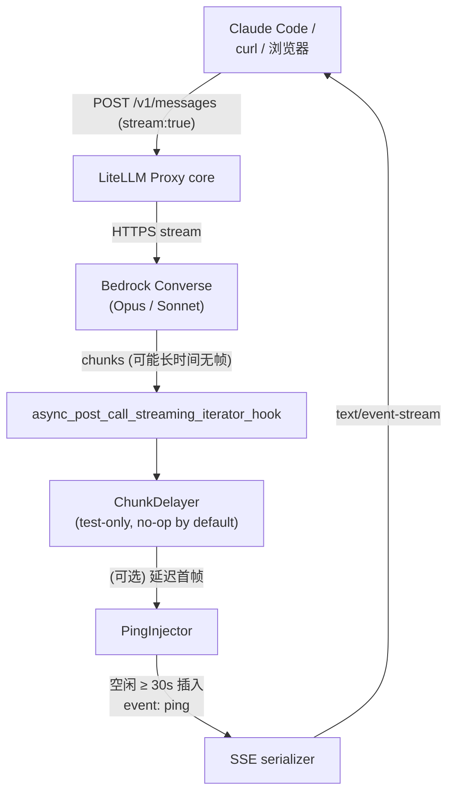
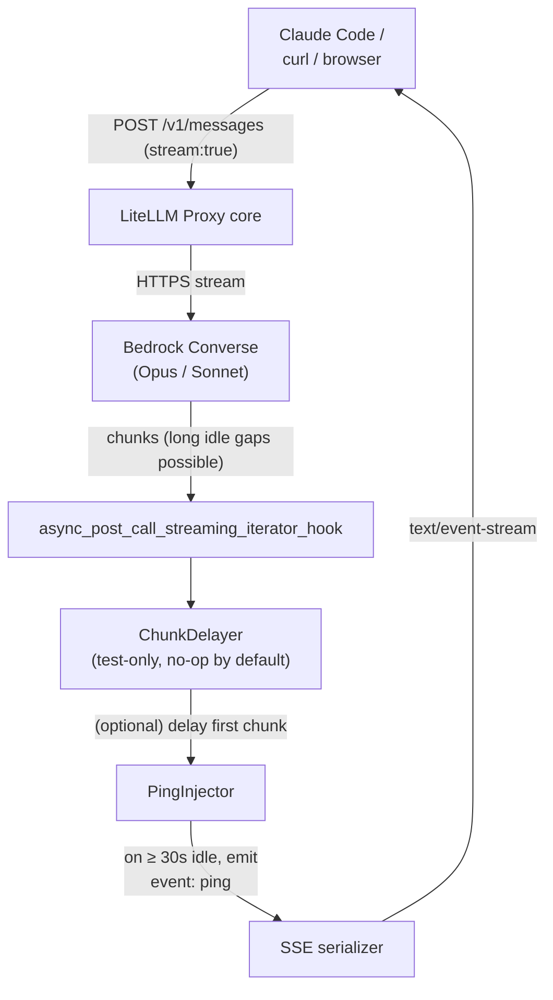

# LiteLLM Gateway Extensions

> 自部署 LiteLLM 网关的**功能扩展仓库** / Feature add-ons for a self-hosted LiteLLM gateway.

本 repo **不是** LiteLLM 上游源码，也不含部署所需的 `config.yaml` / `docker-compose.yml` / `.env`（均在 `.gitignore` 中，由现有部署维护）。
This repo is **not** LiteLLM upstream. It does not track `config.yaml` / `docker-compose.yml` / `.env` — those belong to the deployment.

追踪范围 / Tracked scope:

| Path | Purpose |
|------|---------|
| `callbacks/` | Custom `CustomLogger` callbacks loaded by LiteLLM proxy |
| `docs/superpowers/specs/` | Design docs |
| `docs/superpowers/plans/` | Implementation plans |

---

## 中文

### 当前功能

**`PingInjector`** — 为 SSE 流式响应注入 Anthropic 风格的 `event: ping` 心跳帧，修复 Claude Code + Bedrock 长输出场景下因空闲超时被判异常、回退 non-stream、最终 hang 的问题。

**`ChunkDelayer`** — 测试工具：强制延迟上游第一帧 `CHUNK_DELAY_SECONDS` 秒，用来模拟慢 TTFB，验证 `PingInjector` 是否真的在空闲期发心跳。**默认 no-op**（`CHUNK_DELAY_SECONDS=0`），日常不启用。

### Hook 调用链路

`PingInjector` 挂在 LiteLLM 的 `async_post_call_streaming_iterator_hook` 上，它是 proxy 在把上游 SSE 流交给 SSE 序列化器之前的最后一个改造点。



`PingInjector` 内部并发结构：

```
                  ┌──────────── pump 任务 ──────────────┐
upstream chunks ──► async for chunk in response:       │
                  │     q.put(("item", chunk))         │
                  └────────────────────┬───────────────┘
                                       ▼
                            ┌──── asyncio.Queue ───┐
                                       ▲
                  ┌──────────── tick 任务 ──────────────┐
                  │  while True:                       │
                  │    await asyncio.sleep(interval)   │
                  │    q.put(("ping", _PING_FRAME))    │
                  └────────────────────────────────────┘

主生成器循环:
    kind, v = await q.get()
    if kind == "done":   return
    if kind == "error":  raise v
    if kind == "ping" and (now - last_yield) < interval:
        continue                          # 不够空闲,丢弃这个 ping 候选
    yield v
    last_yield = now
```

要点：
- `tick` 周期性**投候选**，真正发不发由主循环用 `last_yield` 决策——保证帧密集期不塞冗余 ping。
- 下发的是**预格式化的 SSE 字符串** `event: ping\ndata: {"type":"ping"}\n\n`；若改用 dict，LiteLLM 的 SSE 序列化会丢掉 `event:` 行。
- callback 必须在 `config.yaml` 里写成 `callbacks.ping_injector.instance`（实例，而非类），因为 LiteLLM 的 `get_instance_fn` 是按 `getattr` 解析点号路径的。

### 从零配置（5 步）

假设你已经有一份可跑的 LiteLLM 部署（容器名 `litellm`，工作目录含 `docker-compose.yml` / `config.yaml` / `.env`），把本 repo 克隆到同一工作目录（或把 `callbacks/` 拷过去）后按以下步骤改你自己的部署文件——这些文件**不在本 repo 追踪范围**，所以要本地手动改。

**① 挂载 `callbacks/` 并让 Python 能 import**

编辑 `docker-compose.yml`，在 `litellm` service 下追加：

```yaml
services:
  litellm:
    environment:
      - PYTHONPATH=/app
      - PING_INTERVAL_SECONDS=${PING_INTERVAL_SECONDS:-30}
      - CHUNK_DELAY_SECONDS=${CHUNK_DELAY_SECONDS:-0}
    volumes:
      - ./callbacks:/app/callbacks:ro
```

`PYTHONPATH=/app` 让 `callbacks.ping_injector` 能被 import；`:ro` 只读挂载避免容器误写。

**② 在 `config.yaml` 注册 callback**

```yaml
litellm_settings:
  callbacks:
    - callbacks.ping_injector.instance
    # 要造"强制 hang"测试环境再加上面一行:
    # - callbacks.chunk_delayer.instance
```

注意写 `.instance`（预构建的实例）而非 `.PingInjector`（类）——LiteLLM 用 `getattr` 解析点号路径，写成类会报错。

**③ 在 `.env` 设置参数**

```dotenv
PING_INTERVAL_SECONDS=30
# CHUNK_DELAY_SECONDS=300   # 仅测试时启用
```

**④ 重启容器让配置生效**

```bash
docker compose restart litellm
docker compose logs --tail=30 litellm    # 确认无 ImportError / Traceback
```

**⑤ 验证 ping 帧确实下发**

向网关发一个流式请求，用 `-N`（不缓冲）观察 SSE 流——长空闲时应能看到 `event: ping` 帧：

```bash
curl -N -H "Authorization: Bearer $LITELLM_MASTER_KEY" \
     -H "Content-Type: application/json" \
     -d '{"model":"claude-opus-4-7","stream":true,
          "messages":[{"role":"user","content":"慢慢数到 5"}]}' \
     http://localhost:4000/v1/messages
```

期望在输出里看到：

```
event: ping
data: {"type":"ping"}
```

想强制触发 ping：临时把 `.env` 里 `CHUNK_DELAY_SECONDS` 设为 `300`、并在 `config.yaml` callbacks 列表里把 `callbacks.chunk_delayer.instance` 加在 `ping_injector` **之前**，`docker compose restart litellm`。验证完别忘了把它们改回来。

### 环境变量

| 变量 | 默认 | 说明 |
|------|------|------|
| `PING_INTERVAL_SECONDS` | `30` | 空闲多久后下发 ping；同时也是"帧密集时抑制 ping"的阈值 |
| `CHUNK_DELAY_SECONDS` | `0` | 仅测试用。>0 时 `ChunkDelayer` 强制延迟首帧这么多秒，用来验证 ping 是否真的在空窗期出现 |

---

## English

### What's here

**`PingInjector`** — injects Anthropic-style `event: ping` heartbeat frames into streaming responses during idle gaps. Fixes a hang where Claude Code, talking to Bedrock via LiteLLM, falls back to non-streaming after an idle SSE window and gets stuck.

**`ChunkDelayer`** — test-only helper that forces the first upstream chunk to be delayed by `CHUNK_DELAY_SECONDS`, letting you reproduce slow-TTFB scenarios to verify `PingInjector` actually fires. No-op by default.

### Hook pipeline

`PingInjector` hooks `async_post_call_streaming_iterator_hook` — the last transform point before LiteLLM's SSE serializer hits the wire.



Internals of `PingInjector`:

- A **`pump`** task drains the upstream async iterator into a queue.
- A **`tick`** task periodically enqueues ping *candidates*.
- The outer generator pulls from the queue, tracks `last_yield`, and only emits a ping candidate if the idle gap is actually `≥ interval` — so dense chunks never interleave with redundant pings.
- The ping payload is a **pre-formatted SSE string**, because serializing a dict would drop the `event: ping` line.
- Register as `callbacks.ping_injector.instance` (the pre-built instance, not the class) — LiteLLM resolves the dotted path via `getattr`.

### Configuration from scratch (5 steps)

Assuming you already have a working LiteLLM deployment (container `litellm`, a working dir containing `docker-compose.yml` / `config.yaml` / `.env`), clone this repo into that working dir (or copy `callbacks/` in), then edit your deployment files — **they are not tracked here**, so you have to maintain them locally.

**① Mount `callbacks/` and make it importable**

In `docker-compose.yml`, extend the `litellm` service:

```yaml
services:
  litellm:
    environment:
      - PYTHONPATH=/app
      - PING_INTERVAL_SECONDS=${PING_INTERVAL_SECONDS:-30}
      - CHUNK_DELAY_SECONDS=${CHUNK_DELAY_SECONDS:-0}
    volumes:
      - ./callbacks:/app/callbacks:ro
```

`PYTHONPATH=/app` lets `callbacks.ping_injector` resolve; `:ro` is just hygiene.

**② Register the callback in `config.yaml`**

```yaml
litellm_settings:
  callbacks:
    - callbacks.ping_injector.instance
    # Only add this when you want to synthesize a hang for testing:
    # - callbacks.chunk_delayer.instance
```

Use `.instance` (the pre-built instance), not `.PingInjector` (the class). LiteLLM resolves dotted paths via `getattr` — passing the class won't work.

**③ Set parameters in `.env`**

```dotenv
PING_INTERVAL_SECONDS=30
# CHUNK_DELAY_SECONDS=300   # only when you want to test
```

**④ Restart**

```bash
docker compose restart litellm
docker compose logs --tail=30 litellm    # check for ImportError / Traceback
```

**⑤ Verify ping frames actually reach the client**

Hit the gateway with a streaming request and `curl -N` (unbuffered). You should see `event: ping` frames during idle gaps:

```bash
curl -N -H "Authorization: Bearer $LITELLM_MASTER_KEY" \
     -H "Content-Type: application/json" \
     -d '{"model":"claude-opus-4-7","stream":true,
          "messages":[{"role":"user","content":"count to 5 slowly"}]}' \
     http://localhost:4000/v1/messages
```

Expected frames in output:

```
event: ping
data: {"type":"ping"}
```

To force pings deterministically: temporarily set `CHUNK_DELAY_SECONDS=300` in `.env`, add `callbacks.chunk_delayer.instance` **before** `ping_injector` in the `config.yaml` callbacks list, restart. Revert both when done.

### Environment variables

| Var | Default | Meaning |
|-----|---------|---------|
| `PING_INTERVAL_SECONDS` | `30` | Idle threshold before a ping is emitted; also the dedup window during dense chunks |
| `CHUNK_DELAY_SECONDS` | `0` | Test-only. When > 0, `ChunkDelayer` holds the first upstream chunk for this many seconds to synthesize a long idle gap |

---

## References

- Design: [`docs/superpowers/specs/2026-05-09-ping-injector-design.md`](docs/superpowers/specs/2026-05-09-ping-injector-design.md)
- Plan: [`docs/superpowers/plans/2026-05-09-ping-injector.md`](docs/superpowers/plans/2026-05-09-ping-injector.md)
- LiteLLM `CustomLogger` hook: `async_post_call_streaming_iterator_hook`
